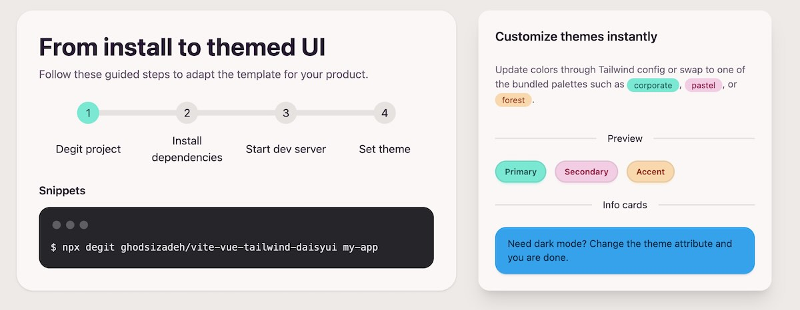

# Vue 3 + TypeScript + Vite

   This template should help get you started developing with Vue 3 and TypeScript in Vite. The template uses Vue 3 `<script setup>` SFCs, check out the [script setup docs](https://v3.vuejs.org/api/sfc-script-setup.html#sfc-script-setup) to learn more.

   Learn more about the recommended Project Setup and IDE Support in the [Vue Docs TypeScript Guide](https://vuejs.org/guide/typescript/overview.html#project-setup).

 
## Vite + Vue 3 + Tailwind CSS v4 + DaisyUI Starter

This repository is a starter template for building Vue 3 apps with Vite, TypeScript, Tailwind CSS v4, and DaisyUI. Tailwind v4 is configured via `@tailwindcss/vite` and DaisyUI is enabled in `src/style.css`.

<!-- add image from docs/image.jpg -->


### Quick Start

1) Create a new project with degit

```bash
npx degit 'ghodsizadeh/vite-vue-tailwind-daisyui' my-app
cd my-app
```

2) Install dependencies

- npm: `npm install`
- pnpm: `pnpm install`
- yarn: `yarn`

3) Start development server

- npm: `npm run dev`
- pnpm: `pnpm dev`
- yarn: `yarn dev`

4) Build and preview

- Build: `npm run build` | `pnpm build` | `yarn build`
- Preview: `npm run preview` | `pnpm preview` | `yarn preview`

### What’s inside

- Vue 3 with `<script setup>` and TypeScript
- Vite for lightning-fast dev/build
- Tailwind CSS v4 via `@tailwindcss/vite` (no PostCSS file needed)
- DaisyUI for components and theming

Key files:

- `vite.config.ts` uses Vue and Tailwind plugins
- `src/style.css` imports Tailwind and DaisyUI (all themes)
- `package.json` scripts: `dev`, `build`, `preview`

### Tailwind + DaisyUI usage

Use Tailwind utilities and DaisyUI component classes in your Vue SFCs:

```vue
<template>
  <div class="p-6 space-y-4">
    <h1 class="text-2xl font-bold">Hello Tailwind + DaisyUI</h1>
    <button class="btn btn-primary">Primary Button</button>
    <div class="card bg-base-100 shadow">
      <div class="card-body">
        <h2 class="card-title">Card title</h2>
        <p>Card content</p>
      </div>
    </div>
  </div>
</template>
```

Enable or restrict themes in `src/style.css` via the DaisyUI plugin block. Switch themes by setting `data-theme`:

```html
<html data-theme="light">
  <!-- ... -->
</html>
```

Or toggle dynamically:

```ts
document.documentElement.setAttribute('data-theme', 'dark')
```

### Requirements

- Node.js 18+ recommended
- Any package manager (npm, pnpm, yarn)

### Links

- Vue: https://vuejs.org/
- Vite: https://vite.dev/
- Tailwind CSS: https://tailwindcss.com/
- DaisyUI: https://daisyui.com/
